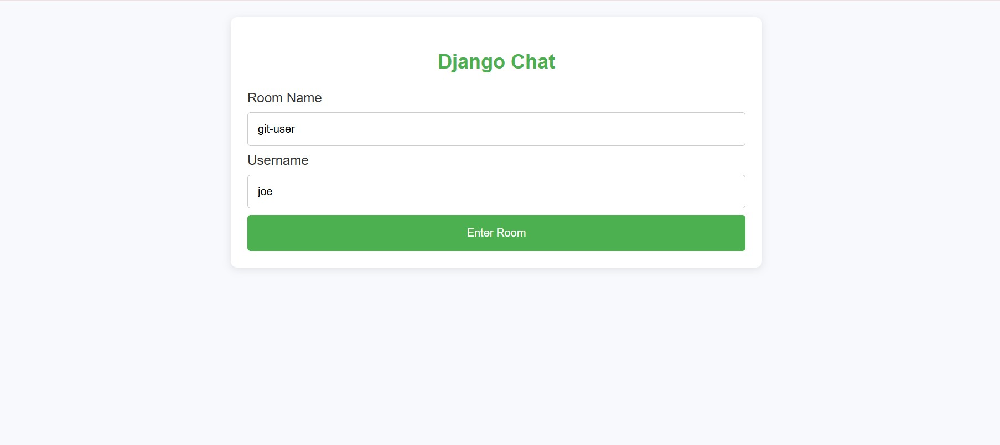
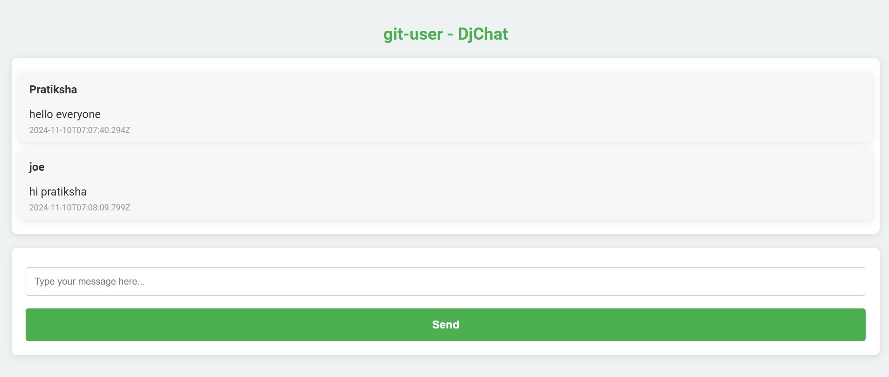

# Django Chat Application

A real-time chat application built with Django and jQuery. This app allows users to create chat rooms and send messages in real time within these rooms.

## Features

- **Create and join chat rooms**: Users can create or join chat rooms by entering a room name and username.
- **Real-time messaging**: Messages are updated in real time using AJAX polling every second. Also added Auto-scroll Chat Display feature.
- **Responsive UI**: The application is styled to work well on various devices.
- **Django-powered backend**: Using Django to handle room and message management.
  
## Tech Stack

- **Backend**: Django
- **Frontend**: HTML, CSS, JavaScript (jQuery)
- **Database**: SQLite (default in Django)

## Screenshots

### Main Page


### Chat Room


## Installation

### Prerequisites

- Python 3.6+
- pip (Python package installer)
- Django 3.0+

### Setup

1. **Clone the repository**:
   ```bash
   git clone https://github.com/yourusername/django-chat-app.git
   cd django-chat-app
